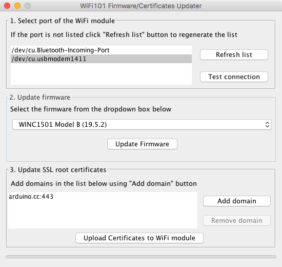
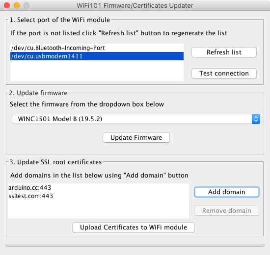

## How to connect an Arduino MKR1000 Client with HTTPS

1. Update the Arduino IDE to the latest version (min test version 1.8.5)
2. Open the IDE
3. Go to `Examples > Wifi101 > FirmwareUpdater`
4. Upload that sketch into your MKR1000
5. Open `Tools > Wifi101 Firmware Updater`

You should see something like this:



6. Select the port to which your Arduino is connected.
7. Select the `WINC1501 Model B (19.5.2)` firmware and click `Update Firmware`
8. Add the specific url's that you are trying to connect to. The default port is `443` and then click `Upload Certificates to WiFi module`.

You should now see something like this:



9. You can now close that sketch and upload your code that creates an HTTPS Client.
10. Here's a demo sample:

```arduino
// -----
// Sample code for Arduino HTTPS Client
// -----

#include <SPI.h>
#include <WiFi101.h>
#include "arduino_secrets.h"
#include "ArduinoJson.h" // This is to parse the response

char ssid[] = SECRET_SSID;
char pass[] = SECRET_PASS;

int status = WL_IDLE_STATUS;

char server[] = "ssltest.com";
int port = 443;

const int buttonPin = 9;
int buttonState = 0;
const int ledPin =  13;  

WiFiSSLClient client;

// Main Setup
void setup() {
  Serial.begin(9600);
  pinMode(ledPin, OUTPUT);
  pinMode(buttonPin, INPUT);
  while (!Serial);

  while (status != WL_CONNECTED) {
    Serial.print("Attempting to connect to SSID: ");
    Serial.println(ssid);
    status = WiFi.begin(ssid, pass);
    delay(1000);
  }
  Serial.println("Connected to wifi");
}

// Main Loop
void loop() {
  buttonState = digitalRead(buttonPin);
  if (buttonState == HIGH) {
    digitalWrite(ledPin, HIGH);
    Serial.print("Updating API...");
    request("POST", "/");
  } else {
    digitalWrite(ledPin, LOW);
  }
  delay(1000);
}

// Make a HTTP Request 
void request(String requestType, String endpoint) {
  if (client.connect(server, port)) {
    String PostData = "{\"status\":\"true\",\"token\":\"" + String(TOKEN) + "\"}";
    client.println(requestType + " " + endpoint  + " HTTP/1.1");
    client.println("Host: " + String(server));
    client.println("User-Agent: Arduino/1.0");
    client.println("Connection: close");  
    client.println();
    String line = client.readStringUntil('}');
    Serial.println(line);
    client.println(PostData);
    
    echo("Data Sent. Connection Closed.");

    char status[32] = {0};

    client.readBytesUntil('\r', status, sizeof(status));
    echo(status);
    char endOfHeaders[] = "\r\n\r\n";
    client.find(endOfHeaders);

    const size_t BUFFER_SIZE = JSON_OBJECT_SIZE(3) + JSON_ARRAY_SIZE(2) + 60;
    DynamicJsonBuffer jsonBuffer(BUFFER_SIZE);
  
    JsonObject& root = jsonBuffer.parseObject(client);
  
    echo("Parse values");
    echo(root["status"].as<char*>());
    client.stop();
  }
}

// Utils to print to serial
void echo(const char* message) {
  Serial.println(message);
}
```


