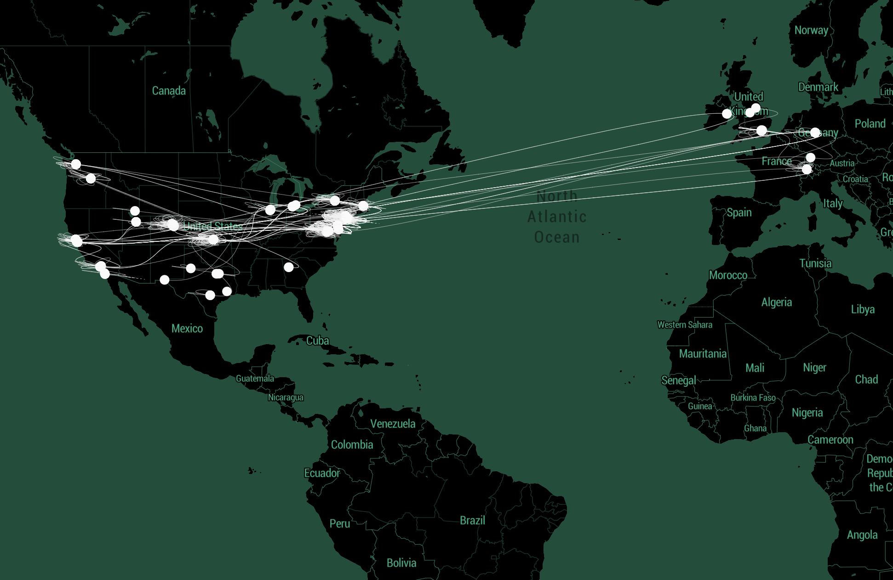

# Traceroute your Browser History

A node application to visualize the traceroute (hops and connections) of your complete browser history.
Currently supports Chrome. Only tested in macOS.



You need to have sqlite3 installed. 

To check if you have sqlite3 installed run:
```
sqlite3 --help
```
If you get a set of options you are good to go. If not, you need to install sqlite3. The easiest way is with brew
```
brew install sqlite3
```

Then run the application:

```bash
npm install

npm run start
```

Bam!

Todo: 
  - visualize amount of times visit
  - support for non found hops